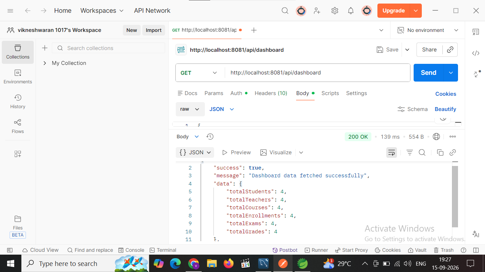

# Education Management System

## Project Overview

Education Management System is a RESTful backend application developed using Java and Spring Boot.

The application is designed to manage students, teachers, courses, enrollments, exams, and grades through REST APIs. It follows a layered architecture and demonstrates important enterprise backend development concepts such as Spring Boot, Spring Data JPA, Hibernate, validation, exception handling, DTOs, mapping, AOP, logging, auditing, versioning, pagination, sorting, caching, file handling, Swagger, Actuator, HikariCP, scheduling, profiles, JWT security, role-based authorization, and unit testing.

---

# Features

- Student Management
- Teacher Management
- Course Management
- Enrollment Management
- Exam Management
- Grade Management
- Student search and email search
- Course search
- Pagination and sorting
- DTO and Mapper implementation
- Input validation
- Global exception handling
- AOP based service logging
- JPA auditing
- Optimistic locking / versioning
- Spring caching
- File upload and download
- Swagger / OpenAPI documentation
- Spring Boot Actuator
- HikariCP connection pooling
- Scheduled tasks
- Spring profiles
- JWT authentication
- Role-based authorization
- BCrypt password encryption
- Dashboard
- Unit testing using JUnit and Mockito

---

# Technologies Used

| Technology | Purpose |
|---|---|
| Java 25 | Programming Language |
| Spring Boot 4.1.1 | Backend Framework |
| Spring Web MVC | REST API Development |
| Spring Data JPA | Database Access |
| Hibernate | ORM |
| MySQL | Relational Database |
| Maven | Build and Dependency Management |
| Lombok | Boilerplate Code Reduction |
| Jakarta Validation | Request Validation |
| Spring AOP | Cross-cutting Concerns |
| Spring Security | Authentication and Authorization |
| JWT | Token-based Authentication |
| Swagger / OpenAPI | API Documentation |
| Spring Cache | Caching |
| Spring Boot Actuator | Monitoring |
| HikariCP | Database Connection Pool |
| JUnit 5 | Unit Testing |
| Mockito | Mocking |

---

# Architecture

The project follows a layered architecture.

```text
Client
   |
   v
Controller
   |
   v
Service
   |
   v
ServiceImpl
   |
   v
Repository
   |
   v
Entity
   |
   v
MySQL Database
```

Additional components:

```text
Security
   |
   └── JWT Authentication

Exception
   |
   └── Global Exception Handler

Aspect
   |
   └── AOP Logging

Config
   |
   ├── Auditing
   ├── Caching
   ├── Swagger
   ├── Security
   └── Actuator

Scheduler
   |
   └── Scheduled Tasks
```

---

# Project Structure

```text
EducationManagementSystem
│
├── src
│   ├── main
│   │   ├── java
│   │   │   └── com.example
│   │   │       │
│   │   │       ├── controller
│   │   │       │   ├── StudentController.java
│   │   │       │   ├── TeacherController.java
│   │   │       │   ├── CourseController.java
│   │   │       │   ├── EnrollmentController.java
│   │   │       │   ├── ExamController.java
│   │   │       │   ├── GradeController.java
│   │   │       │   ├── DashboardController.java
│   │   │       │   ├── FileController.java
│   │   │       │   └── AuthController.java
│   │   │       │
│   │   │       ├── service
│   │   │       ├── serviceimpl
│   │   │       ├── repository
│   │   │       ├── entity
│   │   │       ├── dto
│   │   │       ├── mapper
│   │   │       ├── exception
│   │   │       ├── aspect
│   │   │       ├── config
│   │   │       ├── scheduler
│   │   │       └── security
│   │   │
│   │   └── resources
│   │       ├── application.yml
│   │       ├── application-dev.yml
│   │       ├── application-test.yml
│   │       └── application-prod.yml
│   │
│   └── test
│       └── java
│           └── com.example
│               └── serviceimpl
│                   └── StudentServiceImplTest.java
│
├── pom.xml
└── README.md
```

---

# Database Design

Database name:

```text
education_db
```

Main tables:

```text
users
students
teachers
courses
enrollments
exams
grades
```

### Relationships

```text
Teacher 1 ---- * Course

Student 1 ---- * Enrollment

Course 1 ---- * Enrollment

Course 1 ---- * Exam

Enrollment 1 ---- * Grade
```

---

# 37 Concepts Implemented

## 1. Spring Core

Spring Core provides the foundation for dependency injection and IoC in the application.

The project uses Spring-managed components such as:

```java
@Component
@Service
@Repository
@Configuration
```

Constructor injection is implemented using Lombok:

```java
@RequiredArgsConstructor
```

---

## 2. Dependency Injection

Dependencies are injected by Spring instead of creating objects manually.

Example:

```java
private final StudentRepository studentRepository;
```

Spring automatically provides the required repository object.

---

## 3. Spring Boot

Spring Boot is used to create and run the application with minimal configuration.

Main class:

```java
@SpringBootApplication
public class EducationManagementSystemApplication {
}
```

The application runs as a standalone Spring Boot application.

---

## 4. Spring Web MVC

Spring Web MVC is used to build REST controllers.

Example:

```java
@RestController
@RequestMapping("/api/students")
```

The controller receives HTTP requests and sends HTTP responses.

---

## 5. REST API

The application follows REST principles and uses HTTP methods.

```text
POST    -> Create
GET     -> Read
PUT     -> Update
DELETE  -> Delete
```

Example:

```text
POST /api/students
GET  /api/students
PUT  /api/students/{id}
DELETE /api/students/{id}
```

---

## 6. Spring Data JPA

Spring Data JPA is used for database operations.

Repositories extend:

```java
JpaRepository<Entity, Long>
```

Example:

```java
public interface StudentRepository
        extends JpaRepository<Student, Long> {
}
```

This provides CRUD operations without writing basic SQL manually.

---

## 7. Hibernate ORM

Hibernate is used as the ORM implementation.

It maps Java entity classes to database tables.

Example:

```java
@Entity
@Table(name = "students")
public class Student {
}
```

Java objects can therefore be stored and retrieved from MySQL.

---

## 8. Entity Relationships

JPA relationships are used between the education entities.

Examples:

```java
@OneToMany
@ManyToOne
```

Relationships implemented include:

```text
Teacher -> Course
Student -> Enrollment
Course -> Enrollment
Course -> Exam
Enrollment -> Grade
```

---

## 9. DTO

Data Transfer Objects are used to separate API request/response data from entity objects.

Request DTO examples:

```text
StudentRequestDto
TeacherRequestDto
CourseRequestDto
EnrollmentRequestDto
ExamRequestDto
GradeRequestDto
LoginRequestDto
```

Response DTOs are used for API responses.

---

## 10. Mapper

Mapper classes convert between DTOs and entities.

```text
Request DTO
     ↓
Entity
     ↓
Database
```

And:

```text
Database
     ↓
Entity
     ↓
Response DTO
```

This keeps the controller and service layers clean.

---

## 11. Validation

Jakarta Bean Validation is used to validate incoming request data.

Annotations include:

```java
@NotBlank
@NotNull
@Email
@Pattern
@Min
@Max
@PastOrPresent
```

Validation is triggered using:

```java
@Valid
```

Example:

```java
@NotBlank(message = "Student name is required")
private String studentName;
```

---

## 12. Global Exception Handling

Centralized exception handling is implemented using:

```java
@RestControllerAdvice
```

The project contains:

```text
GlobalExceptionHandler
ResourceNotFoundException
DuplicateResourceException
ErrorResponse
```

Handled errors include:

```text
404 -> Resource Not Found
409 -> Duplicate Resource
400 -> Validation / Illegal Argument
500 -> Unexpected Error
```

---

## 13. Spring AOP

Spring AOP is used for cross-cutting concerns such as service-layer logging.

The project uses:

```java
@Aspect
@Component
```

The logging aspect records service method execution.

Example:

```text
Method started: StudentServiceImpl.getStudentById(..)
Method completed: StudentServiceImpl.getStudentById(..)
```

---

## 14. Logging

Lombok `@Slf4j` is used for logging.

Example:

```java
log.info("Education Scheduler executed at: {}",
        LocalDateTime.now());
```

Logging helps monitor application execution and debugging information.

---

## 15. Auditing

JPA Auditing is enabled using:

```java
@EnableJpaAuditing
```

The application tracks creation and modification timestamps.

Example:

```java
@CreatedDate
private LocalDateTime createdAt;

@LastModifiedDate
private LocalDateTime updatedAt;
```

---

## 16. Versioning

Optimistic locking is implemented using:

```java
@Version
private Long version;
```

The version value is automatically maintained by JPA when an entity is updated.

This helps prevent conflicting updates.

---

## 17. Pagination

Pagination is implemented for student records.

Example:

```text
GET /api/students/page?page=0&size=10
```

Pagination prevents the application from loading a large number of records at once.

---

## 18. Sorting

Student pagination also supports sorting.

Example:

```text
GET /api/students/page?page=0&size=10&sortBy=studentName&direction=asc
```

Sorting can be performed in ascending or descending order.

---

## 19. Searching

The application supports searching students and courses.

Student search:

```text
GET /api/students/search?name=Vicky
```

Student email search:

```text
GET /api/students/search-by-email?email=vicky@gmail.com
```

Course searches include:

```text
Course Name
Course Code
Duration
Teacher ID
```

---

## 20. Spring Cache

Spring Cache is enabled using:

```java
@EnableCaching
```

The project uses a `students` cache.

Example:

```java
@Cacheable(value = "students", key = "#id")
```

The first request retrieves data from the database and stores it in cache.

Subsequent requests can retrieve the cached value without another database query.

---

## 21. File Upload

The application supports multipart file upload.

Endpoint:

```text
POST /api/files/upload
```

Uploaded files are stored in the configured upload directory.

The service also validates empty files and file names.

---

## 22. File Download

The application supports file download.

Endpoint:

```text
GET /api/files/download/{fileName}
```

The file is read from storage and returned as a downloadable response.

Basic path traversal protection is implemented.

---

## 23. Swagger / OpenAPI

Swagger is used to document and test REST APIs.

Swagger UI:

```text
http://localhost:8081/swagger-ui.html
```

OpenAPI documentation:

```text
http://localhost:8081/v3/api-docs
```

JWT Bearer authentication is also configured for Swagger.

---

## 24. Spring Boot Actuator

Actuator provides monitoring and management endpoints.

Configured endpoints include:

```text
/actuator/health
/actuator/info
/actuator/metrics
/actuator/education
```

The custom education endpoint provides application status information.

---

## 25. Custom Actuator Endpoint

A custom endpoint is implemented using:

```java
@Endpoint(id = "education")
```

Endpoint:

```text
GET /actuator/education
```

Example response:

```json
{
  "application": "Education Management System",
  "status": "UP",
  "message": "Education Management System is running successfully"
}
```

---

## 26. HikariCP

HikariCP is used for database connection pooling.

Configuration includes:

```text
Pool Name          : EducationHikariPool
Maximum Pool Size  : 10
Minimum Idle       : 5
Connection Timeout : 30000 ms
Idle Timeout       : 600000 ms
Max Lifetime       : 1800000 ms
```

Connection pooling improves database connection management.

---

## 27. Scheduler

Spring Scheduling is enabled using:

```java
@EnableScheduling
```

The application executes a scheduled task every 30 seconds.

```java
@Scheduled(fixedRate = 30000)
```

The execution is recorded using application logging.

---

## 28. Application Profiles

The application supports environment-specific configuration.

Files:

```text
application.yml
application-dev.yml
application-test.yml
application-prod.yml
```

The active profile is configured using:

```yaml
spring:
  profiles:
    active: dev
```

---

## 29. Spring Security

Spring Security protects the application's APIs.

Security features include:

```text
Authentication
Authorization
Password Encryption
Role-Based Access Control
JWT
```

Protected API requests require authentication according to the configured security rules.

---

## 30. JWT Authentication

JWT is used for stateless authentication.

Login endpoint:

```text
POST /api/auth/login
```

Example request:

```json
{
  "username": "admin",
  "password": "admin123"
}
```

After successful authentication, the application generates a JWT token.

The token is then sent with protected requests:

```text
Authorization: Bearer <JWT_TOKEN>
```

---

## 31. Role-Based Authorization

The application has two roles:

```text
ADMIN
USER
```

### ADMIN

ADMIN can perform:

```text
Create
Read
Update
Delete
```

### USER

USER can perform:

```text
Read
```

Write operations are restricted to ADMIN according to the security configuration.

---

## 32. BCrypt Password Encryption

Passwords are encrypted using Spring Security's:

```java
BCryptPasswordEncoder
```

Passwords are stored in encrypted form instead of plain text.

The `DataInitializer` creates demo users only when they do not already exist.

---

## 33. Dashboard

The dashboard provides summary information about the education system.

It includes:

```text
Total Students
Total Teachers
Total Courses
Total Enrollments
Total Exams
Total Grades
```

Endpoint:

```text
GET /api/dashboard
```

---

## 34. API Response Wrapper

The project uses a common API response structure:

```java
ApiResponse<T>
```

It contains:

```text
success
message
data
timestamp
```

Example:

```json
{
  "success": true,
  "message": "Student created successfully",
  "data": {},
  "timestamp": "2026-09-15T12:30:00"
}
```

This provides a consistent response format for REST APIs.

---

## 35. Unit Testing

JUnit 5 and Mockito are used for unit testing.

Test class:

```text
StudentServiceImplTest
```

The test suite contains 8 test cases:

1. Get Student - Success
2. Get Student - Not Found
3. Create Student - Success
4. Create Student - Duplicate Email
5. Update Student - Success
6. Update Student - Not Found
7. Delete Student - Success
8. Delete Student - Not Found

The tests use:

```text
@Mock
@InjectMocks
@ExtendWith(MockitoExtension.class)
when()
verify()
assertEquals()
assertThrows()
Mockito.never()
```

---

## 36. Configuration and Database Management

The main configuration is maintained in:

```text
application.yml
```

Important configuration areas include:

```text
MySQL
JPA / Hibernate
HikariCP
Server Port
Logging
File Upload
Actuator
Profiles
```

Database:

```text
education_db
```

Application port:

```text
8081
```

---

## 37. Complete REST API Integration

The project integrates all the implemented concepts into a single RESTful backend application.

The complete flow is:

```text
Client
   |
   v
JWT Authentication
   |
   v
Security / Authorization
   |
   v
Controller
   |
   v
Validation
   |
   v
Service
   |
   +---- AOP / Logging
   |
   v
Mapper
   |
   v
Repository
   |
   v
JPA / Hibernate
   |
   v
MySQL
```

Additional supporting features:

```text
Caching
Auditing
Versioning
Pagination
Sorting
File Handling
Swagger
Actuator
HikariCP
Scheduler
Profiles
Testing
```

This makes the project a complete demonstration of the major Spring Boot backend concepts implemented in the Education Management System.

---


---

# Sample Outputs

The following screenshots demonstrate the major outputs and important features of the Education Management System.

## 1. Swagger API Documentation

Swagger UI displays the available REST APIs for the Education Management System.


---

## 2. Database Tables

The following screenshots show the database tables and sample records used by the application.

### Students Table


### Teachers Table


### Courses Table


### Enrollments Table


### Exams Table


### Grades Table


### Users Table


---

## 3. Validation

This screenshot demonstrates request validation and the corresponding validation error response.


---

## 4. Dashboard

The dashboard provides the overall count of students, teachers, courses, enrollments, exams, and grades.



---

## 5. Custom Actuator Endpoint

The custom Education Actuator endpoint provides the application status and education system information.


---

# API Endpoints

## Authentication

```text
POST /api/auth/login
```

## Students

```text
POST   /api/students
GET    /api/students
GET    /api/students/{id}
PUT    /api/students/{id}
DELETE /api/students/{id}

GET /api/students/search
GET /api/students/search-by-email
GET /api/students/page
GET /api/students/{studentId}/enrollments
```

## Teachers

```text
POST   /api/teachers
GET    /api/teachers
GET    /api/teachers/{id}
PUT    /api/teachers/{id}
DELETE /api/teachers/{id}

GET /api/teachers/{teacherId}/courses
```

## Courses

```text
POST   /api/courses
GET    /api/courses
GET    /api/courses/{id}
PUT    /api/courses/{id}
DELETE /api/courses/{id}

GET /api/courses/search
GET /api/courses/search-by-code
GET /api/courses/search-by-duration
```

## Enrollments

```text
POST   /api/enrollments
GET    /api/enrollments
GET    /api/enrollments/{id}
PUT    /api/enrollments/{id}
DELETE /api/enrollments/{id}

GET /api/enrollments/course/{courseId}/students
```

## Exams

```text
POST   /api/exams
GET    /api/exams
GET    /api/exams/{id}
PUT    /api/exams/{id}
DELETE /api/exams/{id}
```

## Grades

```text
POST   /api/grades
GET    /api/grades
GET    /api/grades/{id}
PUT    /api/grades/{id}
DELETE /api/grades/{id}
```

## Dashboard

```text
GET /api/dashboard
```

## Files

```text
POST /api/files/upload
GET  /api/files/download/{fileName}
```

---

# HTTP Status Codes

| Status | Meaning |
|---|---|
| 200 | Success |
| 201 | Created |
| 204 | No Content |
| 400 | Bad Request |
| 401 | Unauthorized |
| 403 | Forbidden |
| 404 | Not Found |
| 409 | Conflict |
| 500 | Internal Server Error |

---

# How to Run the Project

## 1. Create Database

```sql
CREATE DATABASE education_db;
```

## 2. Configure MySQL

Update the MySQL username and password in:

```text
application.yml
```

Do not commit real database credentials to a public GitHub repository.

## 3. Update Maven

In STS:

```text
Right Click Project
    -> Maven
    -> Update Project
```

## 4. Run Application

Run:

```text
EducationManagementSystemApplication.java
```

## 5. Application URL

```text
http://localhost:8081
```

## 6. Swagger UI

```text
http://localhost:8081/swagger-ui.html
```

---

# Default Demo Users

The application initializes demo users if they do not already exist.

## ADMIN

```text
Username: admin
Password: admin123
Role: ADMIN
```

## USER

```text
Username: user
Password: user123
Role: USER
```

These are demo credentials only. Production applications should use secure credentials and external configuration.

---

# Future Enhancements

- Email notifications
- Attendance management
- Advanced reporting
- Role management
- Cloud file storage
- Frontend application
- Docker deployment
- CI/CD integration
- Advanced authentication
- More comprehensive automated tests

---

# Conclusion

Education Management System is a Spring Boot REST API project that demonstrates a wide range of enterprise backend development concepts.

The project combines REST API development, layered architecture, Spring Data JPA, Hibernate, DTO and Mapper patterns, validation, global exception handling, AOP, logging, auditing, versioning, pagination, sorting, caching, file handling, Swagger/OpenAPI, Actuator, HikariCP, scheduling, profiles, JWT security, role-based authorization, dashboard functionality, and unit testing.

The project is designed as a structured backend system for managing educational activities and demonstrates how different Spring Boot concepts can be integrated into a single application.
